# Types and Operations
Objects are pieces of memory, with values and sets of associated operations. Everything we process in Python programs is a kind of obj 

The Python Conceptual Hierarchy:
1. Programs are composed of modules.
2. Modules contain statements.
3. Statements contain expressions.
4. Expressions create and process objects.

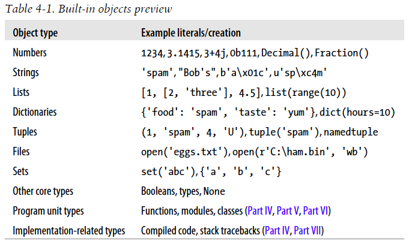

In formal terms, this means that Python is dynamically typed , a model that keeps track of types for you automatically instead of requiring declaration code, but it is also strongly typed, a constraint that means you can perform on an object only operations that are valid for its type.

## Core Types
Immutable: number, string, tuple, bytes  
Mutable: list, dictionary, set, bytearray

Primitive: number  
Collection:

* Sequence: string, tuple, bytes, list,  bytearray

* Mapping: dictionary, set

bytearray  is a distinct hybrid of immutable bytes  strings (whose b'...'  syntax is required in 3.X and optional in 2.X) and mutable lists  (coded and displayed in [] ).

Generic operations that span multiple types show up as built-in functions or expressions (e.g. `len(X)` , `X[0]` ), but type-specific operations are method calls (e.g., `aString.upper()` ).

Both `dir`  and `help`  also accept as arguments either a real object  (like our string S) , or the name of a data type  (like str , list , and dict ).

As a notable difference, Python 2.X allows its normal and Unicode strings to be mixed in expressions as long as the normal string is all ASCII; in contrast, Python 3.X has a tighter model that never  allows its normal and byte strings to mix without explicit conversion.

None of the string object’s own methods support pattern-based text processing.

Unlike out-of-bounds assignments in lists, which are forbidden, assignments to new dictionary keys create those keys, fetching a nonexistent key is still a mistake. (Use the get() method)

A file’s contents are always a string in your script, regardless of the type of data the file contains:

```python
>>> for line in open('data.txt'): print(line)
```

Text files represent content as normal str strings and perform unicode encoding and decoding automatically when writing and reading data, while  binary files represent content as a special bytes string and allow you to access file content unaltered.

Sets are unordered collections of unique and immutable objects.  
Decimal, Fraction, booleans

As you’ll learn, in Python, we code to object interfaces (operations supported), not to types.

## Numbers
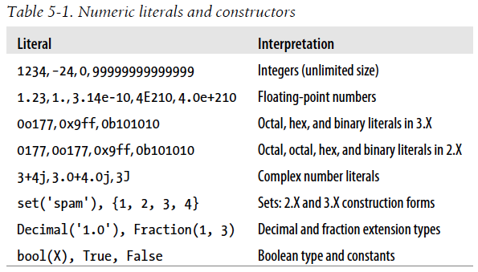

Floating-point numbers are implemented as C “doubles” in standard CPython, and therefore get as much precision as the C compiler used to build the Python interpreter gives to doubles.

built-in calls: `hex(I)`, `oct(I)`, `bin(I)`, `int(str,base)`, `X.bit_length()`, `round(X)`, `X.as_integer_ratio()`

Internally, complex numbers are implemented as pairs of floating-point numbers

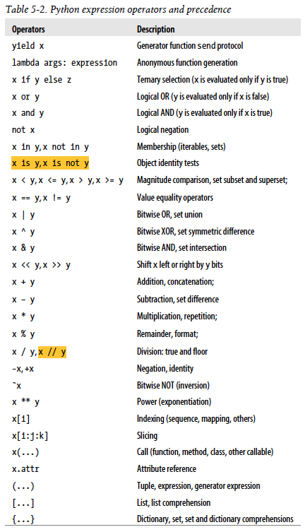

Comparison operators may be chained: X < Y < Z  produces the same result as X < Y and Y < Z .
```python
>>> 1 == 2 < 3 # Same as: 1 == 2 and 2 < 3
False    # Not same as: False < 3 (which means 0 < 3, which is true!)
```

Note that `-x` precedes `x//y`
```python
>>> -3//2
-2
>>> -(3//2)
-1
>>> 0-3//2
-1
```

In recent Pythons, the slice expression X[I:J:K]  is equivalent to indexing with a slice object: X[slice(I, J, K)].

In Python 3.X, nonnumeric mixed-type magnitude comparisons are not allowed and raise exceptions; this includes sorts by proxy.

* Operators lower in the table have higher precedence, and so bind more tightly in mixed expressions.
* Operators in the same row in Table 5-2  generally group from left to right when combined (except for exponentiation, which groups right to left, and comparisons, which chain left to right).

Besides mixing operators in expressions, you can also mix numeric types: in mixed-type numeric expressions, Python first converts operands up  to the type of the most complicated operand, and then performs the math on same-type operands. Python ranks the complexity of numeric types like so: integers are simpler than floating point numbers, which are simpler than complex numbers. 

In general, Python does not convert across any other type boundaries automatically. Adding a string to an integer, for example, results in an error, unless you manually convert one or the other.

 In 3.X, the / now always performs  true division, returning a float result that includes any remainder, regardless of operand types. The // performs  floor division, which truncates the remainder and returns an integer for integer operands or a float if any operand is a float.

The // operator truncates the result down to its floor, which means the closest whole number below the true result.

Frozenset

Internally, the names True  and False  are instances of bool , which is in turn just a subclass (in the object oriented sense) of the built-in integer type int . True  and False  behave exactly like the integers 1 and 0, except that they have customized printing logic.
```
>>> True + 4 # (Hmmm)
5
```

Numpy, Scipy
	
The dynamic typing:  
A variable never has any type information or constraints associated with it. The notion of type lives with objects, not names. Variables are generic in nature; they always simply refer to a particular object at a particular point in time.

Variables always link to objects and never to other variables, but larger objects may link to other objects (for instance, a list object has links to the objects it contains).
These links from variables to objects are called references  in Python—that is, a reference is a kind of association, implemented as a pointer in memory

Technically speaking, objects have more structure than just enough space to represent their values. Each object also has two standard header fields: a ==type designator==  used to mark the type of the object, and a ==reference counter==  used to determine when it’s OK to reclaim the object.

reference counter, cyclic reference  
	`sys.getrefcount(X)`

If a[:], a[k] appears in expression, they are copied. e.g. after b=a[:3], b refers to a new object.
If a[:], a[k] appears in left side of assignment, they referred to the original object. e.g.  after a=[0,1,2]   a[:] = [0,1], a becomes [0,1]

 Because everything  seems to work by assignment and references in Python, a basic understanding of this model is useful in many different contexts. As you’ll see, it works the same in assignment statements, function arguments, for loop variables, module imports, class attributes, and more. The good news is that there is just one  assignment model in Python;

### 注意slice的陷阱
In s[i:j:k], if `i` or `j` is negative, the index is relative to the end of sequence `s`: `len(s) + i` or `len(s) + j` is substituted. But note that `-0` is still `0`.
```python
s = "abcdefg";
print(s[1:-1:-1]); # '', not 'ba'
```

weakref

## String
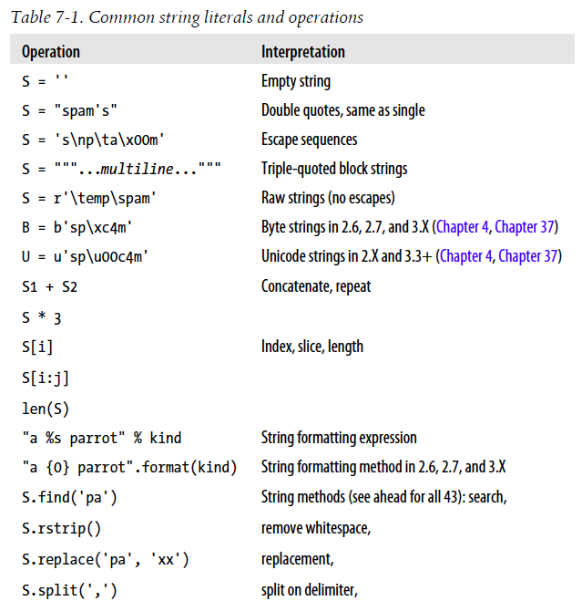

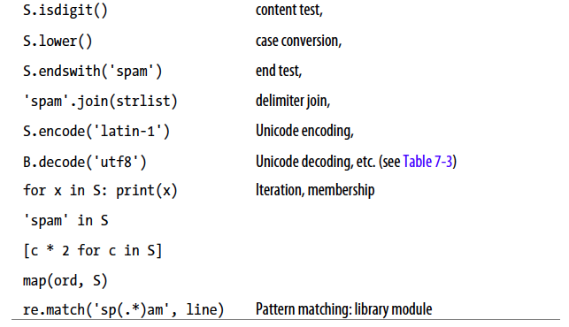
String literal forms:
* Single quotes: 'spa"m'
* Double quotes: "spa'm"
* Triple quotes: '''... spam ...''' , """... spam ..."""
* Escape sequences: "s\tp\na\0m"
* Raw strings: r"C:\new\test.spm"
* Bytes literals in 3.X and 2.6+ (see Chapter 4 , Chapter 37 ): b'sp\x01am'
* Unicode literals in 2.X and 3.3+ (see Chapter 4 , Chapter 37 ): u'eggs\u0020spam'

In fact, 3.X defines str strings formally as sequences of Unicode code
points, not bytes, to make this clear. There’s more on how strings are stored internally in Chapter 37 if you care to know.

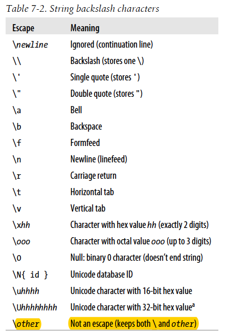

Some escape sequences allow you to embed absolute binary values into the characters of a string.

Python keeps both the string’s length and text in memory. In fact, no character terminates a string in Python

Notice that Python displays nonprintable characters in hex, regardless of how they were specified.

That is, r"...\" is not a valid string literal—a raw string cannot end in
an odd number of backslashes. If you need to end a raw string with a
single backslash, you can use two and slice off the second (r'1\nb\tc\\'[:-1]), tack one on manually (r'1\nb\tc' + '\\'), or skip the raw string syntax and just double up the backslashes in a normal string ('1\\nb\\tc\\').


```
>>> menu = """spam # comments here added to string!
... eggs # ditto
... """
>>> menu
'spam # comments here added to string!\neggs # ditto\n'
>>> menu = (
... "spam\n" # comments here ignored
... "eggs\n" # but newlines not automatic
... )
>>> menu
'spam\neggs\n'
```


built-in tool: `ord()` `chr()`

The method call expression: object.method(arguments) is evaluated from left to right—Python will first fetch the method  of the object  and then
call it, passing in both object and the arguments

string formatting expressions and string formatting method calls  
 Technically, the format  built-in runs the subject object’s `__format__`  method, which the str.format  method does internally for each formatted item.
The %  expressions tend to be a bit simpler and more concise; the format  method has a handful of advanced features that the %  expression does not, but even more involved formatting still seems to be essentially a draw in terms of complexity.
```
>>> from formats import commas, money
```
Types Share Operation Sets by Categories:
* numbers
* sequences
* mappings

## Lists and Dictionaries

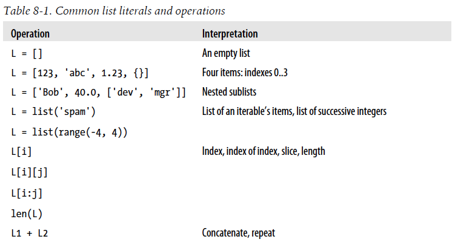
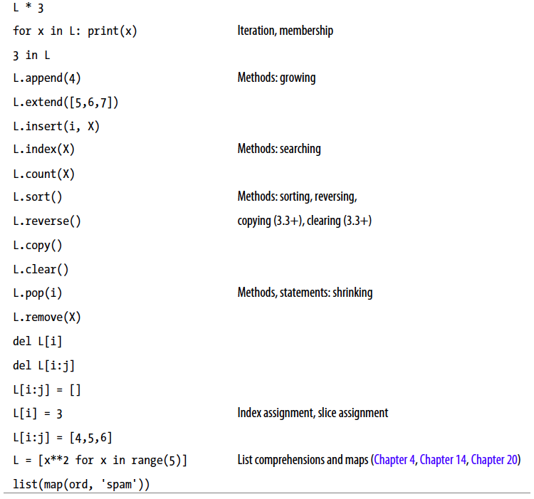
Slice assignment, the last operation in the preceding example, replaces an entire section of a list in a single step. Because it can be a bit complex, it is perhaps best thought of as a combination of two steps:
1. Deletion. The slice you specify to the left of the = is deleted.
2. Insertion. The new items contained in the iterable object to the right of the = are inserted into the list on the left, at the place where the old slice was deleted.
Note, L[2:5]=L[3:6], for instance, works fine because the value to be inserted is fetched before the deletion
happens on the left.
```
>>> L = [1]
>>> L[:0] = [2, 3, 4] # Insert all at :0, an empty slice at front
>>> L
[2, 3, 4, 1]
>>> L[len(L):] = [5, 6, 7] # Insert all at len(L):, an empty slice at end
>>> L
[2, 3, 4, 1, 5, 6, 7]
>>> L.extend([8, 9, 10]) # Insert all at end, named method
>>> L
[2, 3, 4, 1, 5, 6, 7, 8, 9, 10]
```

The effect of `L.append(X)`  is similar to `L+[X]`, but while the former changes L  in place, the latter makes a new list.

L.sort() vs. sorted  
built-in tools: reversed

Like lists, dictionaries store object references (not copies, unless you ask for them explicitly)

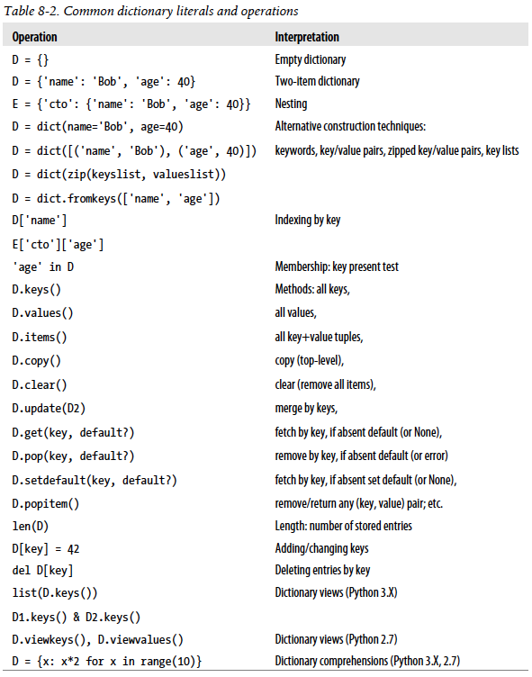

keys  in 3.X returns an iterable  object, instead of a physical list
Unlike lists, however, whenever you assign a new  dictionary key (one that hasn’t been assigned before) you create a new entry in the dictionary.

In 3.X the dictionary keys , values , and items  methods all return view objects , whereas in 2.X they return actual result lists. 
Besides being iterable, dictionary views also retain the original order of dictionary components, reflect future changes to the dictionary, and may support set operations. Unlike 2.X’s list results, though, dictionary views in 3.X are not carved in stone when created—they dynamically reflect future changes  made to the dictionary after the view object has been created:

 In set operations, views may be mixed with other views, sets, and dictionaries; dictionaries
are treated the same as their keys  views in this context:
```
>>> D = {'a': 1, 'b': 2, 'c': 3}
>>> D.keys() & D.keys() # Intersect keys views
{'b', 'c', 'a'}
>>> D.keys() & {'b'} # Intersect keys and set
{'b'}
>>> D.
```

```
>>> Ks.sort()
AttributeError: 'dict_keys' object has no attribute 'sort'
```
To work around this, in 3.X you must either convert to a list manually or use the
sorted call (introduced in Chapter 4 and covered in this chapter) on either a keys view
or the dictionary itself:

OrderedDict

## Tuples, files and everything else
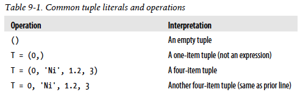
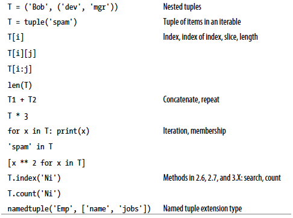

As you can see, named tuples are a tuple/class/dictionary hybrid
 (In short, named tuples build new classes that extend the tuple type, inserting a property  accessor method for each named field that maps the name to its position)

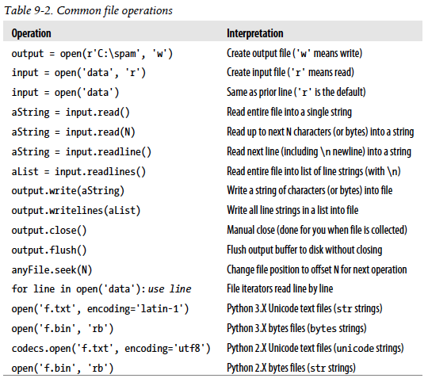

Empty lines in the file come back as strings containing just a newline character, not as empty strings.
```
>>> myfile.readline() # Empty string: end-of-file
''
```

* Text files  represent content as normal str  strings, perform Unicode encoding and decoding automatically, and perform end-of-line translation by default.
* Binary files  represent content as a special bytes  string type and allow programs to access file content unaltered.

pickle, shelve, json, struct

 In fact, when nested objects are present, Python automatically
traverses data structures to apply comparisons from left to right, and as deeply as
needed.

 More specifically, Python compares types as follows:
- Numbers  are compared by relative magnitude, after conversion to the common highest type if needed.
- Strings  are compared lexicographically (by the character set code point values returned by `ord` ), and character by character until the end or first mismatch ("abc"< "ac" ).
- Lists  and tuples  are compared by comparing each component from left to right, and recursively for nested structures, until the end or first mismatch ([2] > [1, 2] ).
- Sets  are equal if both contain the same items (formally, if each is a subset of the other), and set relative magnitude comparisons apply subset and superset tests.
- Dictionaries  compare as equal if their sorted (key, value)  lists are equal. Relative magnitude comparisons are not supported for dictionaries in Python 3.X, but they work in 2.X as though comparing sorted (key, value)  lists.
- Nonnumeric mixed-type magnitude comparisons (e.g., 1 < 'spam' ) are errors in Python 3.X. They are allowed in Python 2.X, but use a fixed but arbitrary ordering rule based on type name string. By proxy, this also applies to sorts, which use comparisons internally: nonnumeric mixed-type collections cannot be sorted in 3.X.

Python 3.X  disallows mixed-type magnitude testing, except numeric types.

More generally, the notions of true and false are intrinsic properties of every  object in Python—each object is either true or false, as follows:
- Numbers are false if zero, and true otherwise.
- Other objects are false if empty, and true otherwise.

 That is, *None*  is something, not nothing (despite its name!)—it is a real object and a real piece of memory that is created and given a built-in name by Python itself.

 In fact, even types themselves are an object type in Python.
 Calls to these names are really object constructor calls, not simply conversion functions, though you can treat them as simple functions for basic usage.

For classic classes in Python 2.X, all class instances are instead of the type “instance,” and we must compare instance `__class__` attributes to compare their types meaningfully.

Repetition Adds One Level Deep
```python
>>> L = [4, 5, 6]
>>> X = L * 4 # Like [4, 5, 6] + [4, 5, 6] + ...
>>> Y = [L] * 4 # [L] + [L] + ... = [L, L,...]
```

If you remember that repetition, concatenation, and slicing copy only the top level of their operand objects, these sorts of cases make much more sense

Beware of Cyclic  Data Structure
```python
>>> L = ['grail'] # Append reference to same object
>>> L.append(L) # Generates cycle in object: [...]
>>> L
['grail', [...]]
```