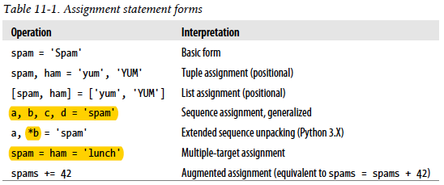

# Statements and Syntax
## Assignments, Expressions, and Prints
- Assignments create object references. (i.e. link a name with an object) They always create references to objects instead of copying the objects.
- Names are created when first assigned.
- Names must be assigned before referenced.

Module imports, function and class definitions, for  loop variables, and function arguments are all implicit assignments.



sequence assignment—any sequence of names can be
assigned to any sequence of values, and Python assigns the items one at a time by position. In fact, the original tuple and list assignment forms in Python have been generalized to accept any type of sequence (really, iterable) on the right as long as it is of the same length as the sequence on the left.

Multiple-target assignment: Python assigns a reference to the same object (the object farthest to the right) to all the targets on the left.

In tuple/list assignment, Python creates a temporary tuple that saves the original values of the variables on the right before assigning.

we can even assign nested sequences, and Python unpacks their parts according to their shape, as expected. The sequence-nesting shape of the object on the left must match that of the object on the right.
> This nested tuple (really, sequence) unpacking
> assignment form works for function argument lists in Python 2.X (though not in 3.X)

In short, a single starred name, *X, can be used in the assignment target in order to specify a more general matching against the sequence—the starred name is assigned a list, which collects all items in the sequence not assigned to other names. In fact, the starred name can appear anywhere in the target.
> This is similar in spirit to slicing, but not exactly the same—a sequence unpacking assignment always returns a list for multiple matched items, whereas slicing returns a sequence of the same type as the object sliced
```
>>> a, *b = 'spam'
>>> a, b
('s', ['p', 'a', 'm'])
>>> S[0], S[1:] # Slices are type-specific, * assignment always returns a list
('s', 'pam')
```

Finally, errors can still be triggered if there is more than one starred name, if there are too few values and no star (as before), and if the starred name is not itself coded inside a sequence:
```
>>> *a = seq
SyntaxError: starred assignment target must be in a list or tuple
```

For augmented assignments, inplace operations may be applied for mutable objects as an optimization.
```
>>> L = [1, 2]
>>> L = L + [3] # Concatenate: slower
>>> L
[1, 2, 3]
>>> L.append(4) # Faster, but in place
>>> L
[1, 2, 3, 4]
>>> L += [9, 10] # Mapped to L.extend([9, 10])
>>> L
[1, 2, 3, 4, 5, 6, 7, 8, 9, 10]
```
Note however, that because of this equivalence += for a list is not exactly the same as a + and = in all cases—for lists += allows arbitrary sequences (just like extend), but concatenation normally does not:
```
>>> L = []
>>> L += 'spam' # += and extend allow any sequence, but + does not!
>>> L
['s', 'p', 'a', 'm']
>>> L = L + 'spam'
TypeError: can only concatenate list (not "str") to list
```
> Although Python now supports statements like X += Y, it still does not
> have C’s auto-increment/decrement operators (e.g., X++, −−X).

### Naming
For portability, case also matters in the names of imported module files, even on platforms where the filesystems are case-insensitive.

True, False, and None, are somewhat unusual in meaning—they also appear in the built-in scope of Python described in Chapter 17, and they are technically names assigned to objects.

Names that begin with a single underscore (_X) are not imported by a from module import * statement

Names that begin with two underscores and do not end with two more (__X) are localized (“mangled”) to enclosing classes.

### Expression Statements
In Python, you can use an expression as a statement, too. Expressions are commonly used as statements in two situations:
- For calls to functions and methods
- For printing values at the interactive prompt

A statement that is not an expression must generally appear on a line all by itself, not nested in a larger syntactic structure. For example, Python doesn’t allow you to embed assignment statements (=) in other expressions. Besides, C assignments return the value assigned, but Python assignments are just statements, not expressions.

Expression statements are often used to run list methods that change a list in place:
```
>>> L = L.append(4) # But append returns None, not L
>>> print(L) # So we lose our list!
None
```

Normally, whether printed output is buffered in memory or not is determined by file; passing a true value to flush forcibly flushes the stream.

Because the print statement just sends text to the sys.stdout.write method, you can capture printed text in your programs by assigning sys.stdout to an object whose write method processes the text in arbitrary ways

## if Tests and Syntax Rules
There is no switch or case statement in Python

* Block and statement boundaries are detected automatically.
* Compound statements = header + “:” + indented statements. 
* Blank lines, spaces, and comments are usually ignored.
* Docstrings are ignored but are saved and displayed by tools.

Statements may span multiple lines if you’re continuing an open syntactic
pair.

Boolean operators stop evaluating (“short circuit”) as soon as a result is known. Boolean **and** and **or** operators return a true or false object in Python, not the values True or False

For `A = Y if X else Z`, Python runs expression Y only if X turns out to be true, and runs expression Z only if X turns out to be false.

When defining classes, we can specify their Boolean nature with either the
__bool__ or __len__ methods.


##  while and for Loops
The optional **else** block run if didn't exit loop with **break**

Python doesn’t have what some languages call a “do until” loop statement. Python has no "go to" statement.

Python 3.X (but not 2.X) allows ellipses coded as ... (literally, three consecutive dots) to appear any place an expression can. Because ellipses do nothing by themselves, this can serve as an alternative to the pass statement,
```
>>> X = ... # Alternative to None
>>> X
Ellipsis
```

After the **for** loop, this loop variable normally still refers to the last item visited, which is the last item in the sequence unless the loop exits with a break statement.

Even nested structures may be automatically unpacked this way in a for:
```
>>> for ((a, b), c) in [((1, 2), 3), ((4, 5), 6)]: print(a, b, c)
```

In fact, as a general rule, you should resist the temptation to count things in Python—its iteration tools automate much of the work you do to loop over collections in lower-level languages like C.

built-in tools: range, zip, enumerate

The zip function is more general than this example suggests. For instance,
it accepts any type of sequence (really, any iterable object, including files), and it accepts more than two arguments. Moreover, zip truncates result tuples at the length of the shortest sequence when the argument lengths differ.

## Iterations and Comprehensions
* Iterator vs. Iterable  vs. Iteration tool/context
* Single scan vs. multiple scan

In some cases these two objects are the same when only a single scan is supported (e.g., files), and the iterator object is often temporary, used internally by the iteration tool. Moreover, some objects are both an iteration context tool (they iterate) and an iterable object (their results are iterable)—including Chapter 20’s generator expressions, and map and zip in Python 3.X.

When the for loop begins, it first obtains an iterator from the iterable object by passing it to the iter built-in function; the object returned by iter in turn has the required next method. The iter function internally runs the __iter__ method, much like `next` and `__next__`.

For comprehensions, their full syntax allows for any number of **for** clauses, each of which can have an optional associated **if** clause.

Keep in mind, though, that every built-in tool that scans from left to right across objects uses the iteration protocol.

Notice that, unlike map and others, sorted returns an actual list in Python 3.X
instead of an iterable.

One of the fundamental distinctions of Python 3.X is its stronger emphasis on iterators than 2.X. This, along with its Unicode model and mandated new-style classes, is one of 3.X’s most sweeping changes.

Unlike **range**, **map**, **zip**, **filter** are their own iterators—after you step through their results once, they are exhausted.

In Python 3.X the dictionary keys, values, and items methods return iterable view objects that generate result items one at a time.

## Documentation Interlude
The PyDoc system covered here can render a module’s internal documentation as either plain text in a shell, or HTML in a web browser.

The **help** function: press the space bar to move to the next page, Enter to go to the next line, and Q to quit:

Sphinx