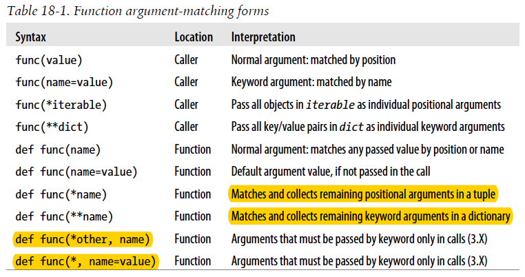

# Functions and Generators
## Function Basics
* *def* is executable code. it’s legal (and even occasionally useful) to nest def statements inside if statements, while loops, and even other *def*s.
* *def* creates an object and assigns it to a name. Function objects may also have arbitrary user-defined *attributes* attached to them to record data.

Names are always looked up in *scopes*—places where variables are stored— and assignments bind names to scopes.

>Files must generally be rewound (e.g., with a file.seek(0) or another
>open) after they have been read to end-of-file once, and so are single-pass iterators

## Scopes
When we talk about the search for a name’s value in relation to code, the term
scope refers to a namespace: that is, the location of a name’s assignment in your source
code determines the scope of the name’s visibility to your code.

By default, all names assigned inside a function are associated with that function’s namespace, and no other.

Lexical scoping:
- If a variable is assigned inside a def, it is local to that function.
- If a variable is assigned in an enclosing def, it is nonlocal to nested functions.
- If a variable is assigned outside all defs, it is global to the entire file.

Each module is a global scope, the global scope spans a single file only.
* Assigned names are local unless declared global or nonlocal
* All other names are enclosing function locals, globals, or built-ins.
* Each call to a function creates a new local scope.

> Note `L=X` within a function will classify L as a local, but L.append(X) will not.

### Name Resolution: The LEGB Rule
- Name assignments create or change local names by default.
- Name references search at most four scopes: local, then enclosing functions (if any), then global, then built-in.
- Names declared in global and nonlocal statements map assigned names to enclosing module and function scopes, respectively.

Note that the second scope lookup layer, E—the scopes of enclosing defs or lambdas—can technically correspond to more than one lookup level.

Also keep in mind that these rules apply only to simple variable names (e.g., spam). Qualified attribute names (e.g., object.spam) live in particular objects and follow a completely different set of lookup rules than those covered here.

There are technically three more scopes in Python—temporary loop variables in some comprehensions, exception reference variables in some try handlers, and local scopes in class statements

In 3.X, the loop variables are local to the expression itself in all comprehension forms: generator, list, set, and dictionary. In 2.X, they are local to generator expressions and set and dictionary compressions, but not to list comprehensions that map their names to the scope outside the expression. By contrast, for loop statements never localize their variables to the statement block in any Python.

In 3.X, exception reference variables are local to that except block, and in fact are removed when the block is exited (even if you’ve used it earlier in your code!).

Although the LEGB rule is used to resolve
names used in both the top level of a class itself as well as the top level of method functions nested within it, classes themselves are skipped by scope lookups—their names must be fetched as object attributes.

### The global/nonlocal Statement
The global statement consists of the keyword global, followed by one or more names separated by commas. All the listed names will be mapped to the enclosing module’s scope when assigned or referenced within the function body. 
```
global x
```

The name x do not need even exist in the enclosing module
before the function runs; in this case, the first assignment in the function creates x in the module.

If, on the other hand, X is declared nonlocal within the function in 3.X (only), the assignment changes the name X in the closest enclosing function’s local scope. The name X must have been defined in at least one enclosing function.

```
def f1():
x = 88
def f2(x=x): # Remember enclosing scope X with defaults
print(x)
f2()
f1() # Prints 88
```
Because the second x is evaluated before Python steps into the nested def, it still refers to the x in f1.
```
def func():
x = 4
action = (lambda n, x=x: x ** n) # Pass x in manually
return action
```
Loop variables may require defaults, not scopes, Compare
```
>>> def makeActions():
acts = []
for i in range(5): # Tries to remember each i
acts.append(lambda x: i ** x) # But all remember same last i!
return acts
```
with
```
>>> def makeActions():
acts = []
for i in range(5): # Use defaults instead
acts.append(lambda x, i=i: i ** x) # Remember current i
return acts
```
Because defaults are implemented as single objects attached to functions, mutable defaults retain state from call to call, rather than being initialized anew on each call.

Unlike global, nonlocal names must already exist in the enclosing function’s scope when declared. In fact, they are checked at function definition time before either an enclosing or nested function is called.

Nonlocal both allows assignment to names in enclosing function scopes and limits scope lookups for such names to enclosing defs.

Python uses naming conventions in both 2.X and 3.X that ensure that the arbitrary names you assign as function attributes won’t clash with names related to internal implementation.

To summarize: globals, nonlocals, classes, and function attributes all offer changeable state-retention options.

## Arguments
In Python 2.X, it’s also possible to automatically unpack tuples in arguments passed to a function.
```
def f((a,(b,c)))
```
This def syntax is no longer supported in Python 3.X. Instead, code this function as:
```
def f(T): (a, (b, c)) = T
```
Tuple unpacking argument syntax is also disallowed by 3.X in lambda
function argument lists. Somewhat asymmetrically, tuple unpacking assignment is still automatic in 3.X for loops targets

By default, arguments are matched by position, from left to right, and you must pass exactly as many arguments as there are argument names in the function header.



In a function call, arguments must appear in this order: any positional arguments or the  *iterable form, followed by any keyword arguments or the **dict form. If we see *iterable and **dict as being unpacked to positional arguments and keyword arguments, the order becomes: any positional arguments, followed by any keyword arguments. In a broad sense, there are only two arguments: positional and keyword.
```
def foo(a,b,c,d,e,f,g):
  print('ok')
b=[2]
x = {'d':4,'e':5}
y = {'f':6}
foo(1,*b,3,**x,g=7,**y)  //ok
```
> In a function header, we use the term "parameter" instead of "argument"

In a function header, parameters must appear in this order: any normal parameter(name); followed by any default parameters (name=value); followed by the *name (or \* in 3.X) form; followed by any name or name=value keyword-only arguments (in 3.X); followed by the **name form

We can use a * character by itself in the arguments list to indicate that a function does not accept a variable-length argument list but still expects all arguments following the * to be passed as keywords.

The *name=value* form has two meaning:
- before the form *name, it's positional with default value
- after the form *name, it's keyword-only with default value

There can be at most one *name parameter, which collects all remaining positional arguments (including those in *iterabe). Similarly, There can be at most one *\*dict parameter, which collects all remaining keyword arguments (including those in *\*dict arguments).

```
def foo(a,b=3,*c,d,**e):
    print(b,e)
x = [3,4]
y = {'d':5,'e':6,'f':7}
foo(1,2,*x,**y)   # 2 {'e': 6, 'f': 7}
```
The steps that Python internally carries out to match arguments before
assignment can roughly be described as follows:
1. Assign nonkeyword arguments by position.
2. Assign keyword arguments by matching names.
3. Assign extra nonkeyword arguments to *name tuple.
4. Assign extra keyword arguments to **name dictionary.
5. Assign default values to unassigned arguments in header.

> Note that in both function call and header, the *name = value* form are not assignments.

The default parameters are attached to function objects, if you code
a default to be a mutable object (e.g., def f(a=[])), the same, single
mutable object is reused every time the function is later called—even if
it is changed in place within the function.

Below is a tracer function example:
```
def tracer(func, *pargs, **kargs): # Accept arbitrary arguments
  print('calling:', func.__name__)
  return func(*pargs, **kargs) # Pass along arbitrary arguments
```

## Advanced Function Topics
In fact, recursion is not used nearly as often in Python as in
more esoteric languages like Prolog or Lisp, because Python emphasizes simpler procedural statements like loops, which are usually more natural.

On the other hand, recursion—or equivalent explicit stack-based algorithms we’ll meet shortly—can be required to traverse arbitrarily shaped structures.

Also note that standard Python limits the depth of its runtime call stack—crucial to recursive call programs—to trap infinite recursion errors. To expand it, use the **sys** module:
```
>>> sys.getrecursionlimit() # 1000 calls deep default
1000
>>> sys.setrecursionlimit(10000) # Allow deeper nesting
>>> help(sys.setrecursionlimit) # Read more about it
```

### Function attributes and annotations
```
>>> func.__code__
>>> func.__code__.co_varnames
```
Python’s own implementation-related data stored on functions follows naming conventions that prevent them from clashing with the more arbitrary attribute names you might assign yourself. In 3.X, all function internals’ names have leading and trailing double underscores (“_\_X__”);

Attributes are related to objects instead of scopes (and must be referenced through the function name within its code).

Python provides special syntax for specifying annotations, but it doesn’t do anything with them itself; annotations are completely optional, and when present are simply attached to the function object’s __annotations__ attribute for use by other tools. Syntactically, function annotations are coded in def header lines, as arbitrary expressions associated with arguments and return values.
```
>>> def func(a: 'spam', b: (1, 10), c: float) -> int:
return a + b + c
>>> func(1, 2, 3)
6
>>> func.__annotations__
{'c': <class 'float'>, 'b': (1, 10), 'a': 'spam', 'return': <class 'int'>}
```

Finally, note that annotations work only in def statements, not lambda expressions.

- **lambda** is an expression, not a statement.
- lambda’s body is a single expression, not a block of statements.
- Defaults work on lambda arguments, just like in a def.
- The code in a lambda body also follows the same scope lookup rules as code inside a def. lambda expressions introduce a local scope much like a nested def, which automatically sees names in enclosing functions, the module, and the built-in scope (via the LEGB rule)

```
>>> ((lambda x: (lambda y: x + y))(99))(4)
103
```

useful library: functools, operator

## Comprehensions and Generations
map calls can be twice as fast as equivalent for loops, and list comprehensions are often faster than map calls.

Generator function vs. Generator vs. Generator expression
- *send* advances to the next item  
- *yield* is now an expression form, it must be enclose in parentheses unless it's the only item on the right ride of the assignment statement.
- methods: *throw*, *close*
- *yield from*

Generator expressions may also run slightly slower than list comprehensions in practice, so they are probably best used only for very large result sets, or applications that cannot wait for full results generation.

A subtle but important point: both generator functions and generator expressions are their own iterators and thus support just one active iteration.

Python 3.X localizes loop variables in all four forms—temporary loop variable names in generator, set, dictionary, and list comprehensions are local to the expression.

In general, list comprehensions are usually the quickest of the bunch; map beats list comprehensions in Python only when all tools must call functions; for loops tend to be slower than comprehensions; and generator functions and expressions are slower than comprehensions by a constant factor. Under

## The benchmarking Interlude
Timeing modules: time, timer, profile, timeit, pystone.py