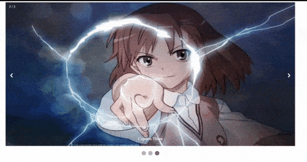

> 2021-12-13 更新 
> * 增加其它要求第6条
> * 补充js要求
> * 其它要求中第7条有改动
> * 题目一稍有改动（自选网站无需报备，需写清模仿哪些页面）

<mark>截止时间：2022年1月13日23点59分</mark>  
小组形式，1-3人为一组（ 促进寝室交流 :zany_face: )，从以下题目中选择一个，每组只需一人提交，同组每人得分相同  
原则：针对本课程的主要知识，考核学生的动手实践能力，检验学生对知识、技能的掌握。    
评分标准：从效果、代码、报告三处的<mark>质量和数量</mark>方面评分（知识技能展示越充分，质量越好，分越高）  

:::warning 提醒
无论选哪个题目，都需要满足“内容技术要求”、“报告要求”、“其它要求”
:::

# 内容技术要求（**重要**）：
1. 完成一张主页index.html和人均至少两张子页面，子页面要尽量不同，不要只是换图片和文字，最好是布局有些不同之处
2. 主页需要有两级导航栏，至少一张网页要有侧边栏
3. 需要使用以下技术（不能只写代码，要看到相应的效果）
* html: 表单form, 表格table, 图片img, 列表ul(或ol)
* css: float+clear布局, position定位（absolute, fixed)，文字悬浮于图片上，伪类，伪元素
* js: 实现以下四种效果中的至少两种，只需实现主体功能，不需要完全相同(最后一张动图有点大，可能需要多加载一段时间)

:::tip 提示
多个要求可以通过同一个模块（或效果）来实现
:::

# 报告要求
除以上指出的外，还需写清楚
* 小组人员名单（姓名和学号）
* 网站的主题或目的
* 网站大致的内容、模块及整体结构
* 用到的主要技术、工具及相应的效果截图
* 大致的步骤，包括失败删除的部分（酌情有加分~）
* 亮点，特别是困难的地方（酌情有加分~）
* 额外附加分项（见下面）
* 最终结果评价、分析、总结

# 其它要求
1. 风格（颜色、字体等）要统一和谐 ，布局要美观，页面要整洁、清晰，不能太乱
2. 文字内容和图片最好要与网页的主题相关，不要像上课的例子一样随便写些无关的文字
3. 代码要清晰、易读，class, id, js变量等的命名要规范、易懂
4. 评分以最新版的谷歌浏览器或Edge浏览器为准，请大家在实验报告中注明自己用的是这两种中的哪一种
5. 需提交所有代码以及报告，全部放在一个文件夹内，打包该文件夹提交。
6. 所有网页都能通过主页直接或间接访问（评分时默认只打开主页文件，其它网页文件都通过跳转来访问）
7. **不得**抄袭 :monocle_face: , 不能抄任何人的，网上摘取的成片的代码要在代码注释或报告中注明出处，小组外他人的帮助也请注明

# 题目一：模仿一个给定的网站
* [印象笔记](https://www.yinxiang.com/)
* [segmentfault](https://segmentfault.com/)
* [腾讯web前端](http://www.alloyteam.com/)
* 其它

注意：
1. 不需要完全一样，特别是超出课程范围内的技术（可自行添加和删除）
2. 如果不满足以上的内容技术要求，需要自行补上
3. 请在报告中说明你访问的网站，具体哪些页面

# 题目二：自行设计一个网站
可以参考以下网站：
1. 个人博客: 
* 参考[月光博客](https://www.williamlong.info/),[阮一峰的网络日志](https://www.ruanyifeng.com/blog/),[个人简历](https://resume.js.org/)
2. 组织网站：给任何一个企业或其它类型的组织设计一个官方网站, 参考[江财](http://www.jxufe.edu.cn/), [清华](https://www.tsinghua.edu.cn/)
3. 主题网站：美食、电影、动漫、音乐、旅游等等
4. 产品网站：参考 [iphone](https://www.apple.com.cn/iphone/) 
5. 商城网站：参考[淘宝](taobao.com)、[京东](jd.com)、[小米](mi.com)等

注意：
1. 以上网站只是参考，可以随意混合（例如商城网站里面也有产品网页），也可以自行选择其它的。
2. 也可以直接模仿，同样不需要全部一样，建议只模仿布局和模块

# 额外加分项
以下项目可以给大作业加分，需在实验报告中指出实现的地方、内容、效果。若是最后超出了大作业的满分，则只取满分。
1. 酷炫的动画效果
2. 适配手机（响应式设计）
3. 使用flex布局，并且有明显的效果。例如不能只是在css上写一个display: flex; 必须要有相应的效果。
4. 其它炫技（可以不与网站内容一致，也不需要保持风格一致，需要在报告中指出），不确定是否算炫技可以随时问我
