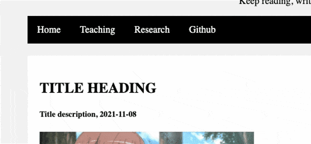
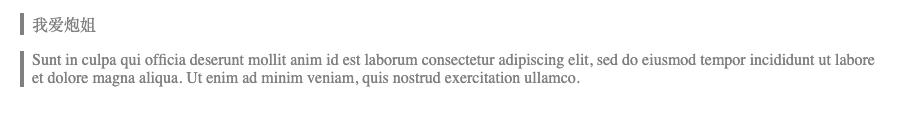
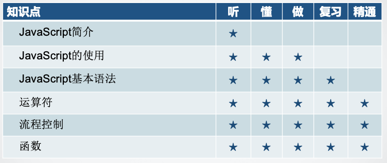

# 第3次作业
要求：
1. 可以复制（文本或截图）到作业框中，也可以上传文件，最好是前者）

解释：
1. 以题目为准，测试文件(1.html)和效果描述只用于参考。
2. 类型一词是指 class (题目中以 . 号开始的名字) 

<a href="https://iguu.cn/teaching/web211/hw3/hw3.zip" download>测试文件下载</a>

# 第1题: 给类型为 .leftcolumn 的元素里面的、任意两个类型为 .card 的相邻子元素（需要是.leftcolumn的子元素）加一条分隔线
效果描述：正文区每两篇文章间有一条分隔线
要求：
1. 只用css实现，不得更改html（只需提交css代码）
2. 只能写一个选择器（不能有逗号）
3. 不能有多余的分隔线

# 第2题：给所有一级、二级、三级标题加上以下效果。鼠标移到标题元素上，该标题左边会出现一个符号(任意可见符号或字母都行)，鼠标移走时会消失
效果描述：

要求：
1. 只用css实现，不得更改html（只需提交css代码）
2. 鼠标移到标题元素上时，原标题的内容和位置不得变化

# 第3题：给所有类型为 .blockquote 的 p 加上左坚线（灰色），若是该p还有.err 类，则该竖线需要是红色，若是该p还有.warn类（没有.err类），则该竖线需要是黄色
效果描述：

要求：
1. 只用css实现，不得更改html（只需提交css代码）

# 第4题：编写html和css代码实现表格
效果描述：

要求：
1. html 代码和css 代码分离（不能直接在标签上写css)
2. 表头（第一行）背景颜色与其它行不同
3. 表中奇数行与偶数行背景颜色不同
4. 文字内容（包括五星形图案）可以随意，单元格内部对齐可以随意

# 第5题 编写html和css代码制作二级导航栏
效果描述：
要求：
1. 实现效果：鼠标移到“课程”上显示二级菜单
2. 鼠标在“课程”或二级菜单上时，二级菜单仍然显示
3. 鼠标离开“课程”和二级菜单时，二级菜单消失
4. “主页”、“博客” 和二级菜单里面的内容只需做个大致的样子

